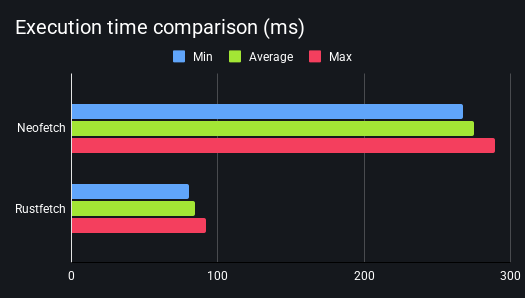

# Rustfetch


Rustfetch is a CLI tool designed to **fetch system information** in the **fastest** and **safest** way possible while still keeping it visually appealing, inspired by [neofetch](https://github.com/dylanaraps/neofetch) and [fastfetch](https://github.com/fastfetch-cli/fastfetch).

<!-- I think the following image handling is not very markdown idiomatic and there must be a way to do this in a better way, ive tried with an HTML table but GitHub markdown shows huge grey bands in empty table slots, any other approached would be appreaciated -->
<p align="center">
	
	&nbsp;&nbsp;&nbsp;&nbsp;&nbsp;&nbsp;&nbsp;&nbsp;&nbsp;&nbsp;
	
</p>

<p align="center">
	
</p>
<p align="center">
	<sub>Tests ran on identical hardware with default configs, using the <a href="docs/architecture.md/#runtimesh">runtime script</a> (30 runs, 5 warmups).</sub>
</p>

## Installation
You can **copy and paste** this command to use the install script:
```bash
curl -fsSL https://raw.githubusercontent.com/lemuray/rustfetch/main/install.sh | bash
```

Alternatively, you can build the latest unstable version from source:
```bash
cargo install --git https://github.com/lemuray/rustfetch.git
```

**In case installation fails** or you want to know more about the installation process, visit our [guide to installation](docs/guide_to_installation.md).

<sub>Tested on: macOS (Apple Silicon), Ubuntu 22.04 LTS, Arch Linux (x86_64). rustc 1.93.0</sub>

## Usage
**You can run the CLI with the default config by typing ```rustfetch```**

Here are some useful flags you can use:
- ```--help / -h``` shows all commands and descriptions
- ```--all / -a``` enables all config options, useful to **try features out**
- ```--padding / -p x``` adds padding between the ascii logo and the system information, replace x with your value (0-255)
- ```--config-file / -c PATH_TO_FILE``` uses a different config file, if the file does not exist it'll be created with defaults

> This is a selected list of the most used flags, to learn about all the flags visit our [flags guide](docs/flags.md).

## Customization
Rustfetch relies on **TOML files** to parse the configuration, which makes them inherently **user-friendly**.

Modify it by accessing the default directory:
```bash
# Linux / GNU
nano "~/.config/rustfetch/config.toml"
```
```bash
# MacOS
nano "~/Library/Application Support/rustfetch/config.toml"
```

## Any other questions?
In case you want to know the answer to a question that didn't get answered here or you want to start contributing to the project visit our **extensive and user-friendly [documentation](docs/README.md)**.

Enjoy your stay!
